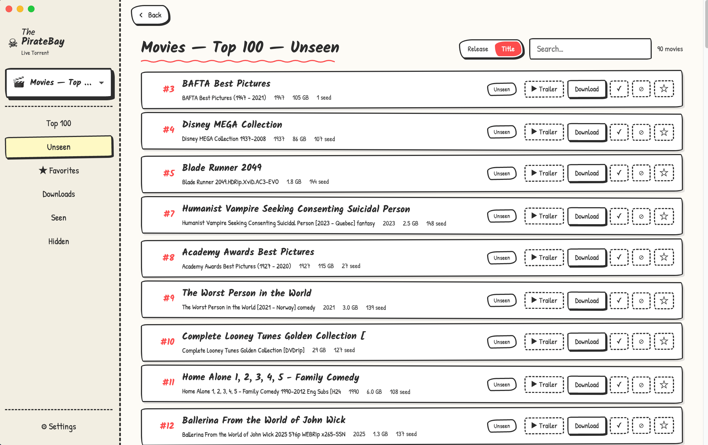

# PirateBay Live Torrent



A local desktop app that tracks listings from The Pirate Bay, enriches them with poster art and metadata from [TMDB](https://www.themoviedb.org/), and lets you download + watch in one click. Built as a single-window Electron app with an embedded BitTorrent engine — no external client to configure, no web UI to keep open.

> **Status:** personal project, macOS-only build at the moment. Source builds on any platform that can run Electron + Transmission, but the packaging story is Mac-first.

---

## What it does

- **Topics.** Save any Top 100 category or search query as a "topic." The app polls each topic on a schedule and tracks what's new.
- **Per-movie state.** Every movie has a status: *unseen / downloading / downloaded / seen / hidden*, plus a favorite flag. Quick-action buttons on every row to mark seen, hide, or favorite.
- **Metadata enrichment.** With a free TMDB API key, the app fills in poster art, year, plot, rating, runtime, and genres for everything it discovers.
- **One-click download.** The app drives a bundled `transmission-daemon` over its local RPC. No separate qBittorrent / Transmission install required — the daemon binary and its dylibs are shipped inside the `.app` bundle.
- **One-click play.** When a download finishes, hit ▶ Play and it opens in your OS default player.
- **Streaming-priority mode.** Optionally prioritize the largest file in a torrent so you can start watching at ~5% downloaded.
- **Delete-while-keeping-history.** Free up disk by deleting the file but keeping the seen/downloaded history intact, so you don't accidentally re-download something you've already watched.
- **Live downloads view.** A global "All downloads" page shows everything in flight or completed across all topics, with peer counts and live speeds.
- **Local-first.** SQLite database, no accounts, no cloud sync. Everything lives in `~/Library/Application Support/piratebay-live-torrent/`.

---

## Install (end users)

Pre-built `.dmg` from [Releases](https://github.com/javalight/PirateBayLiveTorrent/releases):

1. Download the `.dmg` matching your Mac's CPU (`-arm64` for Apple Silicon, `-x64` for Intel).
2. Open the `.dmg` and drag the app to `/Applications`.

### First launch — macOS will block it. Here's how to allow it.

This build is **unsigned** (no paid $99/yr Apple Developer cert), so the first time you double-click the app, macOS Gatekeeper will refuse to open it and show a warning. **The app is fine — you just have to give it permission once.** Pick the path that matches what you see:

#### Path A — "Apple could not verify…" (the common one)

1. Click **Done** on the warning dialog (do **not** click "Move to Trash").
2. Open the Apple menu → **System Settings** → **Privacy & Security**.
3. Scroll down to the **Security** section. You'll see a line saying:
   > "PirateBay Live Torrent" was blocked from use because it is not from an identified developer.
4. Click the **Open Anyway** button next to it.
5. Confirm with your Mac password / Touch ID.
6. macOS will pop the warning one more time — now click **Open**.

That's it. From now on the app launches normally with a double-click.

#### Path B — "App is damaged and can't be opened"

If you see the "damaged" message instead (less common, depends on browser), open Terminal (⌘+Space → "Terminal") and run:

```bash
xattr -cr "/Applications/PirateBay Live Torrent.app"
```

Then double-click the app. You may still need to do Path A on top of it, but usually one or the other is enough.

> The app isn't really damaged — that's just how older macOS phrases the same warning when the browser tagged the download with a `com.apple.quarantine` attribute. The Terminal command strips it.

---

No Homebrew install, no separate torrent client — the BitTorrent engine is shipped inside the bundle.

> Builds are single-architecture by default; if no `-x64` build is published for a given release, build from source (see below) or open an issue.

### Configure TMDB (optional but recommended)

Without a TMDB API key the app still works, but movies show only the raw release name and no poster. To enable enrichment:

1. Get a free key at [themoviedb.org/settings/api](https://www.themoviedb.org/settings/api).
2. Open the app → ⚙ Settings → paste it under **TMDB API key** → Save.

---

## Run from source (developers)

Requires:
- macOS (Apple Silicon or Intel)
- Node.js 20+
- [Homebrew](https://brew.sh/)

```bash
git clone https://github.com/javalight/PirateBayLiveTorrent.git
cd PirateBayLiveTorrent
brew install transmission-cli   # provides transmission-daemon
npm install
npm run dev
```

The `transmission-daemon` binary is auto-discovered from `/opt/homebrew/bin` (Apple Silicon brew), `/usr/local/bin` (Intel brew), or `$PATH`. For packaged `.dmg` builds it's bundled inside the app.

### Building a release `.dmg`

```bash
brew install dylibbundler            # one-time, for self-contained binary bundling
npm run package:mac
```

This:
1. Runs `scripts/bundle-transmission.sh` — copies your local `transmission-daemon` plus its non-system dylibs (`libevent`, `libminiupnpc`) into `resources/bin/`, rewriting their rpaths to `@executable_path/libs/...` so the bundle runs on a clean Mac with no Homebrew installed.
2. Builds the Electron app with `electron-vite`.
3. Runs `electron-builder` to produce a `.dmg` in `dist/`.

The result is fully self-contained — no install dependencies for the end user.

---

## Architecture

```
┌─────────────────┐      ┌───────────────────┐      ┌──────────────┐
│  Electron       │ IPC  │  main process     │ HTTP │ transmission │
│  renderer       │◄────►│  (Node + SQLite)  │ RPC  │   -daemon    │
│  (React)        │      │                   │◄────►│ (child proc) │
└─────────────────┘      └───────────────────┘      └──────────────┘
         │                        │                         │
         └─ React UI: topics,     ├─ DAL (better-sqlite3)   └─ Real BitTorrent
            cards, downloads,     ├─ apibay poller             via libtorrent —
            settings              ├─ TMDB enricher              DHT, trackers,
                                  ├─ DownloadManager            uTP, UPnP/NAT-PMP
                                  └─ Engine wrapper
```

Why not WebTorrent? It was tried (see git history). The pure-JS implementation can't reliably reach traditional BitTorrent swarms on networks where peers are seeded by qBittorrent / libtorrent clients — it found ~0 peers where Transmission finds dozens. So the app embeds Transmission for the heavy lifting and just talks to it over its localhost RPC.

---

## Source layout

```
src/
├── main/              Electron main process
│   ├── db/            SQLite schema, migrations, DAL
│   ├── enrichment/    TMDB client + title parser
│   ├── sources/       apibay client + poller
│   ├── torrents/      Transmission daemon supervisor + RPC + engine wrapper
│   ├── config.ts      Settings persistence (electron safeStorage)
│   └── index.ts       App lifecycle + IPC handlers
├── preload/           contextBridge surface
├── renderer/          React UI
│   └── src/
│       ├── App.tsx          Routing, history, sidebar
│       ├── components/      MovieCard, MovieGrid, etc.
│       ├── views/           Top100, Filtered, Search, Master, Settings, ...
│       ├── hooks/           useMovies, useDownloads
│       └── contexts/        DisplayMode (release-name vs movie-title toggle)
└── shared/            Types, IPC channel names, settings schema
```

---

## Legal notice

This software is a metadata browser and BitTorrent client. **It does not host or distribute any content.** Listings come from The Pirate Bay's public read-only JSON API ([apibay.org](https://apibay.org)).

Downloading copyrighted material without permission is illegal in most jurisdictions. You are responsible for what you do with this tool. Use it for what's legal where you live: public-domain content, Creative Commons releases, software ISOs, your own backups, etc.

---

## License

This project's source code is licensed under the [GPL-3.0](LICENSE) license.

The bundled `transmission-daemon` binary is itself licensed under [GPL-3.0](https://github.com/transmission/transmission/blob/main/COPYING) by the Transmission project; redistribution of compiled `.dmg` builds is therefore subject to GPL-3.0 terms.

---

## Credits

- [Transmission](https://transmissionbt.com/) — the BitTorrent engine
- The Pirate Bay (via [apibay.org](https://apibay.org)) — listings
- [TMDB](https://www.themoviedb.org/) — movie metadata + poster art
- [electron-vite](https://electron-vite.org/), [better-sqlite3](https://github.com/WiseLibs/better-sqlite3), [parse-torrent-title](https://github.com/clement-escolano/parse-torrent-title)
